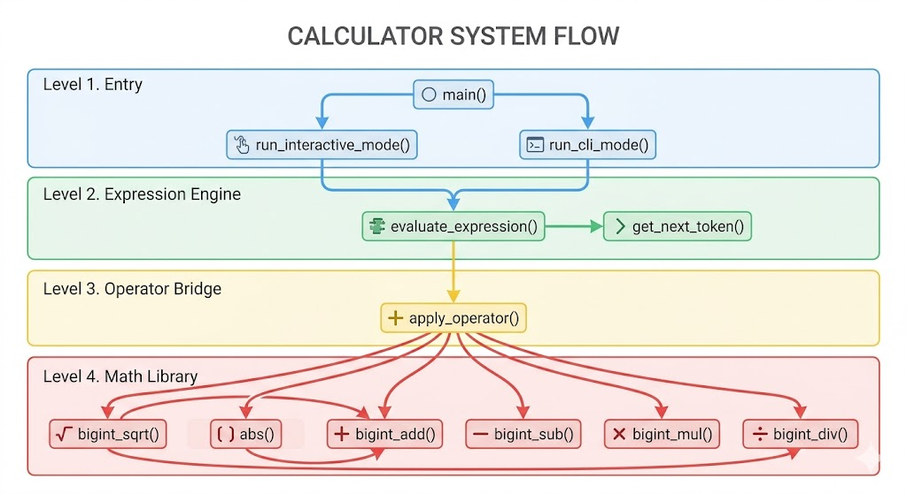

# Simple Calculator using C

## Table of Contents
1. [Operating Manual](#1-operating-manual)
   - [1.1 Two Modes](#11-two-modes-interactive-mode-and-cli-mode)
   - [1.2 Parameter Setting & Formatting](#12-parameter-setting--formatting)
   - [1.3 Input Format](#13-input-format)
2. [Basic Functions](#2-basic-functions)
   - [2.1 Large Number Calculation (BigInt)](#21-large-number-calculation-bigint)
   - [2.2 Decimal Calculation](#22-decimal-calculation)
   - [2.3 Manual Precision](#23-manual-precision--p)
   - [2.4 Long Expression Evaluation](#24-long-expression-evaluation)
   - [2.5 Built-in Functions](#25-built-in-functions)
   - [2.6 Output Formatting Subsystem](#26-output-formatting-subsystem-scientific-notation)
3. [Code Structure](#3-code-structure)
4. [Checking Illegal Input](#4-checking-illegal-input)
   - [4.1 Error Code Definition](#41-error-code-definition)
   - [4.2 Error Interception Layers](#42-error-interception-layers)
   - [4.3 Unified Error Output Presentation](#43-unified-error-output-presentation)
   - [4.4 Memory Safety and Buffer Protection](#44-memory-safety-and-buffer-protection)


## 1. Operating Manual

### 1.1 Two Modes (Interactive Mode and CLI Mode)

The calculator supports two execution modes:

- **Interactive Mode**: Simply run `./calculator`. You will enter a REPL (Read-Eval-Print Loop) where you can type expressions one by one. Type `quit` to exit.
- **CLI Mode**: Run `./calculator "1 + 2 * 3"`. The calculator will evaluate the expression provided as an argument and exit immediately.

### 1.2 Parameter Setting & Formatting

Use the following flags to customize the calculation and output behavior:

#### 1.2.1 Calculation Precision (`-p`)
Use the `-p` flag to specify the number of decimal places for the core calculation and default output (default is 6).

- **Example**: `./calculator -p 10 "sqrt(2)"`
- **In Interactive Mode**: You can also type `-p 10` during the session to update the precision for all subsequent calculations.
- **Syntactic Sugar**: You can use `-p max` to safely push the precision to the engine's absolute safe limit (e.g., ~3000 decimal places), avoiding manual buffer limit calculations.

#### 1.2.2 Output Format & Scientific Notation (`-x`, `-s`)
The calculator dynamically supports formatting large or infinitesimal numbers into scientific notation (e.g. `1.23e+10`).
- **Notation Mode (`-x`)**: Toggles the display mode.
  - `-x auto` (Default): Automatically switches between fixed-point and scientific notation based on the number's magnitude (similar to C's `%g`).
  - `-x off`: Forces fixed-point notation for all numbers, completely unrolling decimals.
  - `-x on`: Forces scientific notation for all numbers.
- **Scientific Precision (`-s`)**: Sets the number of decimal places to keep in the mantissa when outputting in scientific notation (default is 6).
  - **Example**: `./calculator -p max -x on -s 3 "7 / 0.3"` → `2.333e+01`

### 1.3 Input Format

The calculator supports:
- **Numbers**: Including very large integers, decimals and Scientific notation (e.g., `1234567890.12345`, `1.23e4`, `1.23E4`).
- **Operators**: `+`, `-`, `*`, `/`.
- **Grouping**: Parentheses `(...)` to override operator precedence.
- **Functions**: `sqrt(x)` for square root and `abs(x)` for absolute value.

## 2. Basic Functions

### 2.1 Large Number Calculation (BigInt)

Standard C integer types (`int`, `long`) overflow for numbers beyond 64 bits. To support arbitrarily large numbers, all values are stored and computed as **null-terminated character strings**, with arithmetic implemented digit-by-digit — essentially the manual column arithmetic we learned in school.

**Core principle:**

1. **Represent numbers as strings** — `"123456789012345678901234567890"` never overflows.
2. **Process digits from the least significant end** — reverse both strings, iterate position by position, sum/multiply digits and propagate carry.
3. **Handle signs separately** — strip the leading `-`, determine the result sign by the combination of operands' signs, then perform unsigned (`abs`) arithmetic on the digits.

**Code structure for addition (`bigint_add`):**

```c
void bigint_add(const char *num1, const char *num2, char *result) {
    // 1. Detect signs, strip '-' prefix
    // 2. Same sign  → bigint_abs_add(), prepend sign if negative
    // 3. Mixed sign → compare magnitudes → bigint_abs_sub(larger, smaller)
    //                 prepend '-' if the negative operand was larger
}

static void bigint_abs_add(const char *num1, const char *num2, char *result) {
    // Iterate from length-1 down to 0, summing digits + carry
    // Write result in reverse, then reverse_string()
}
```

The same pattern — sign detection → unsigned core → sign restoration — applies to `bigint_sub`, `bigint_mul`, and `bigint_div`.

### 2.2 Decimal Calculation

The BigInt library from section 2.1 operates on **pure integers only** — it has no concept of a decimal point. To support decimal numbers, three lightweight helper functions were introduced as a "decimal layer" that wraps around the BigInt core:

| Function | Role |
|---|---|
| `extract_decimal(input, out, scale)` | Strips the `.` from `"3.14"` → `"314"`, records `scale = 2` |
| `append_zeros(str, n)` | Pads `n` trailing zeros to align two integers to the same scale before add/sub |
| `insert_decimal(str, scale)` | Inserts `.` back at position `scale` from the right: `"464"` → `"4.64"` |

**How they work together in `apply_operator`:**

```c
// Example: 3.14 + 1.5
extract_decimal("3.14", int1, &scale1);  // int1="314", scale1=2
extract_decimal("1.5",  int2, &scale2);  // int2="15",  scale2=1

int max_scale = max(scale1, scale2);     // max_scale=2
append_zeros(int2, max_scale - scale2);  // int2 → "150"  (align to same scale)

bigint_add(int1, int2, result);          // "314" + "150" = "464"
insert_decimal(result, max_scale);       // "464" → "4.64"
```

For **multiplication**, no alignment is needed — the result's scale is simply `scale1 + scale2`.
For **division**, the alignment is the same as add/sub, but `bigint_div` handles the decimal output internally via the `precision` parameter.

### 2.3 Manual Precision (`-p`)

#### 2.3.1 Dynamic Precision Configuration

The system uses a default precision of 6 decimal places, aligning with the standard `bc` utility. Precision is controlled by a single `int precision` variable that flows as a parameter through every layer of the system:

```
main()                              // parses -p N, stores as local precision
  └─ run_interactive_mode(precision)  // OR run_cli_mode(..., precision)
       └─ evaluate_expression(expr, precision)
            └─ apply_operator(..., precision)
                 └─ bigint_div(..., precision, ...)
                 └─ format_fixed_precision(result, ..., precision)
```

In **interactive mode**, the precision can also be changed mid-session with the `-p` command, which updates the local variable for all subsequent calculations in that session.

#### 2.3.2 Rounding (Half-Up)

Rounding is applied at two points:

**In `bigint_div`** — after computing `precision` decimal digits, it computes one extra digit to use as the rounding digit:

```c
// Compute one extra digit beyond precision
round_digit = div_step(remainder, divisor);
if (round_digit >= 5) {
    // carry +1 into the last kept digit
}
```

**In `format_fixed_precision`** — trims or pads any intermediate result to exactly `precision` decimal places, with the same half-up rule:

```c
int round_digit = frac[precision] - '0';  // look one past the cutoff
frac[precision] = '\0';                   // truncate
if (round_digit >= 5) carry_into(frac);   // round up if needed
```

Edge cases handled: rounding `9.999` at 2 places correctly produces `10.00` by propagating carry into the integer part.

#### 2.3.3 Intermediate Precision Truncation (Accumulation Error)
Because the Shunting-Yard evaluator evaluates complex mathematical equations natively by pushing intermediate strings back onto the Value Stack, every intermediate arithmetic operation undergoes formatting and strict truncation to the specified `-p` calculation precision immediately. 
As a result, calculations like `1 / (1 / 3)` at `-p 6` will evaluate the inner parenthesis to `0.333333` first, and then `1 / 0.333333` yields `3.000003`. This faithfully mimics the behavior of physical handheld calculators, ensuring that visible intermediate states perfectly and predictably match the final mathematical pipeline without silently carrying hidden fractions.

### 2.4 Long Expression Evaluation

#### 2.4.1 Shunting-Yard Algorithm

Evaluating complex expressions requires respecting operator precedence and mathematical scopes. We use Dijkstra's **Shunting-Yard algorithm**, using two stacks to process expressions left-to-right:

| Stack | Contents |
|---|---|
| **Value Stack** | Numbers (BigInt strings) or computed intermediate results |
| **Operator Stack** | Operators (`+`, `*`), parentheses `(`, and function markers (`S` for `sqrt`, `A` for `abs`) |

The core rule: before pushing a new operator, **pop and apply** all operators on the stack that have **equal or higher precedence**. Parentheses override this logic to enforce scope.

Precedence handling:

| Element | Priority / Behavior |
|---|---|
| Functions (`sqrt`, `abs`) | Pushed to stack as a special single-character marker (`S`, `A`). Evaluated immediately when their enclosing parenthesis closes. |
| `*`, `/` | Level 2 (High) |
| `+`, `-` | Level 1 (Low) |
| `(`, `)` | Parentheses act as boundaries. When `)` is encountered, all operators are popped and applied until the matching `(` is found. |

#### 2.4.2 Function Collaboration

The pipeline processing `"sqrt(9) + abs(-5)"` naturally handles functions and brackets:

```
[ Lexer ]                         [ Parser Loop ]                       [ Execution ]
get_next_token()                  evaluate_expression()                 apply_operator() / Math APIs

"sqrt"      →  TOKEN_FUNC     →   push 'S' to OpStack
"("         →  TOKEN_LPAREN   →   push '(' to OpStack
"9"         →  TOKEN_NUMBER   →   push "9" to ValStack
")"         →  TOKEN_RPAREN   →   pop operators until '(' 
                                  If 'S' is underneath, trigger   →     bigint_sqrt("9")
"+"         →  TOKEN_PLUS     →   push '+' to OpStack
"abs"       →  TOKEN_FUNC     →   push 'A' to OpStack
"("         →  TOKEN_LPAREN   →   push '(' to OpStack
"-5"        →  TOKEN_NUMBER   →   push "-5" to ValStack
")"         →  TOKEN_RPAREN   →   pop operators until '('
                                  If 'A' is underneath, trigger   →     abs("-5")
END         →  TOKEN_END      →   pop remaining '+'               →     apply_operator(3, 5, '+')
```

This dual-stack architecture naturally supports arbitrary nesting like `sqrt(abs(-16) + 9)`.

### 2.5 Built-in Functions

#### 2.5.1 `sqrt(x)` — Newton's Method on Pure Integers

Rather than introducing floating-point arithmetic, `sqrt` is reduced to a **pure integer problem** using a scaling trick:

$$\sqrt{N} = \frac{\sqrt{N \times 10^{2k}}}{10^k}$$

By appending `2k` zeros to the input's integer representation (via `extract_decimal` + `append_zeros`), we shift the real-valued square root into the integer domain, compute it there, then restore the decimal point with `insert_decimal`.

**Newton's iterative formula** applied on BigInt strings:

$$x_{n+1} = \frac{x_n + N / x_n}{2}$$

Each iteration calls:
- `bigint_div(N, x, ...)` — to compute `N / x`
- `bigint_add(x, quotient, ...)` — to sum `x + N/x`
- `bigint_div(sum, "2", ...)` — to halve

**Termination**: by the AM-GM inequality, once the guess overshoots the true root, all subsequent values **monotonically decrease**. Iteration stops when the new value is no longer smaller than the previous one.

**Decimal input handling**: if the input is a decimal (e.g. `sqrt(2.25)`), `extract_decimal` first strips the decimal point to produce an integer string `"225"` with `scale = 2`. The number of zeros to pad must be **even** — specifically `2k` where `k = scale + work_prec` — because the identity $\sqrt{N \times 10^{2k}} = \sqrt{N} \times 10^k$ only holds when the exponent is even (so that $10^{2k}$ is itself a perfect square). The final `insert_decimal` shifts the decimal point back by exactly `k` positions.

**Irrational / infinite decimals**: most square roots (e.g. `sqrt(2)`) produce infinitely many non-repeating decimal digits. Since Newton's iteration runs on a finite-precision integer, it naturally converges to the floor of the true root at the working precision. The result is then hard-capped by `format_fixed_precision` to exactly the user's precision, with trailing digits discarded and the boundary digit rounded half-up.

**Precision cap**: the internal working precision is capped at 50 decimal places regardless of user-set precision. The final result is then formatted by `format_fixed_precision`. This prevents buffer overflow when the user sets a very large precision.

---

#### 2.5.2 `abs(x)` — String Prefix Strip

Implemented inline in `evaluate_expression()` (lines ~1425–1430) with a single operation:

```c
if (arg[0] == '-') memmove(arg, arg + 1, strlen(arg));
```

No dedicated math function is needed — absolute value on a BigInt string is simply removing the leading `-` character.

### 2.6 Output Formatting Subsystem (Scientific Notation)

To support scientific notation without polluting the core mathematical algorithms (which function purely on absolute strings), the formatter is implemented as a totally independent post-processing layer: `apply_scientific_format()`.

**Zero-Pollution Architecture:**
1. All math is strictly calculated in fixed-point format first, up to `precision` (or clamped by `-p max`).
2. Right before printing, `apply_scientific_format` scans the raw string result to calculate its true exponent $E$.
3. Based on the selected `NotationMode` (`AUTO`, `FIXED`, or `SCI`), it decides whether a transformation is needed.
   - If `AUTO` and $E$ is within the comfortable reading range (e.g. $E \in [-4, 6)$ by default), it skips scientific conversion, perfectly mimicking C's intelligent `%g` specifier.
   - Otherwise, it seamlessly extracts the first non-zero digit, places a decimal point, strips the rest into a mantissa string, rounds the mantissa using `-s` (scientific precision) via `format_fixed_precision`, and appends `e+XX` or `e-XX`.

> [!NOTE]
> **Dependency on Calculation Precision (`-p`)**
> Because the formatting layer only triggers *after* the core math engine yields a fixed-point string, the fixed-point string must contain the non-zero digits for the formatter to find them. If you compute `1 / 1000000000000` with the default `-p 6`, the math engine outputs `0`, and the formatter will simply echo `0`. **Therefore, if you want to capture infinitesimal mathematical results like `1.0e-12`, you must set `-p` (Calculation Precision) high enough (e.g., `-p 15`) to capture the non-zero digits before the scientific formatter can convert them.**

This decoupling allows `-x` and `-s` to manipulate visual presentation identically across both interactive and CLI modes without altering the underlying strict BigInt truth.


## 3. Code Structure

The codebase is organized into four distinct layers. Each layer only calls downward.



| Layer | Functions | Responsibility |
|---|---|---|
| **Entry** | `main`, `run_interactive_mode`, `run_cli_mode` | Parse CLI args, read user input, dispatch |
| **Expression Engine** | `evaluate_expression`, `get_next_token` | Lexer + Shunting-Yard algorithm |
| **Operator Bridge** | `apply_operator` | Strips decimals, aligns scales, dispatches to BigInt, restores result |
| **Math Library** | `bigint_add/sub/mul/div`, `bigint_sqrt`, `abs` | Pure arithmetic on arbitrary-precision strings |

## 4. Checking Illegal Input

The code handles illegal input through a rigorously designed multi-layered architecture. Errors are intercepted at three main stages: Lexical Analysis, Syntax Parsing, and Mathematical Execution. All possible errors are defined in the `ErrorCode` enum, allowing the program to safely bubble them up without crashing.

### 4.1 Error Code Definition
At the beginning of the codebase, the `ErrorCode` enum uniformly manages error types:
*   `SUCCESS`: Successful calculation
*   `ERR_DIV_BY_ZERO`: Division by zero
*   `ERR_INVALID_INPUT`: Invalid input format (e.g., syntax or lexical errors)
*   `ERR_INPUT_TOO_LONG`: Input exceeds maximum buffer capacity
*   `ERR_UNSUPPORTED_OP`: Unsupported operator
*   `ERR_NEGATIVE_SQRT`: Square root of a negative number

### 4.2 Error Interception Layers

#### A. Lexical Analysis (Rejecting invalid characters)
This phase is handled by `get_next_token()` and its underlying helper `parse_number_token()`. It validates the characters themselves:
*   **Malformed Numbers**: If a number string contains invalid formats (e.g., multiple decimal points, invalid scientific notation, or alphabet letters mixed in), `parse_number_token` throws `ERR_INVALID_INPUT`.
*   **Standalone / Invalid Signs**: Explicit positive signs in a unary context (e.g., `+5`) are rejected. Unrecognized mathematical symbols (like `@` or `#`) cause `get_next_token` to return `TOKEN_ERROR`.
*   **Unknown Functions**: If a sequence of letters does not match the hardcoded `sqrt` or `abs` functions, the code will eventually mark it as an invalid input.

#### B. Syntax Parsing (Rejecting invalid expression structures)
This phase is handled by `evaluate_expression()` using the **Shunting-yard algorithm** to check the structural validity of the evaluated string:
*   **Token-level Interception**: If `get_next_token()` yields an error token, the parser immediately aborts and returns `ERR_INVALID_INPUT`.
*   **Mismatched Parentheses (Extra Right)**: When an extra right parenthesis `)` forces the code to pop operators from a stack, and the stack becomes empty before finding a left parenthesis `(`, it returns `ERR_INVALID_INPUT`.
*   **Mismatched Parentheses (Extra Left)**: When the expression ends and the operator stack is flushed, any remaining `(` indicates unmatched parenthesis, triggering `ERR_INVALID_INPUT`.
*   **Missing Operands**: If the program pops numbers from the value stack to apply an operator (e.g. evaluating `* 5` or `5 +`) and finds the stack empty, the underlying stack functions return `ERR_INVALID_INPUT`.
*   **Standalone / Leftover Numbers**: After the entire expression is processed, the value stack must contain exactly **one** final result. If multiple numbers remain (e.g., a user input `5 5` without an operator), the code traps it and returns `ERR_INVALID_INPUT`.

#### C. Mathematical Constraints (Rejecting invalid math logic)
Mathematically forbidden operations are intercepted at the underlying BigInt math functions:
*   **Division by Zero**: `bigint_div` checks if the divisor is composed entirely of zeros using `is_all_zeros_number()` and throws `ERR_DIV_BY_ZERO`.
*   **Negative Square Root**: `bigint_sqrt` checks if the input starts with a negative sign (`-`) and throws `ERR_NEGATIVE_SQRT`.

### 4.3 Unified Error Output Presentation
Regardless of which layer threw the error, the `evaluate_expression()` function bubbles the `ErrorCode` up. 
It is eventually caught by the `print_result()` function, which acts as a centralized error dispatcher. For instance, receiving `ERR_INVALID_INPUT` prompts the user with:
`The input cannot be interpret as numbers!`
This ensures that the user is always presented with human-readable feedback and the program cycle continues smoothly without abrupt termination.

### 4.4 Memory Safety and Buffer Protection
When dealing with arbitrary-precision arithmetic, uncontrolled fractions (like `1/3`) can easily result in buffer overflows (`Segmentation Fault`) if a user requests unreasonable precision. The system fundamentally protects memory at two levels:
1. **Dynamic Generation Checks**: Inside the core expansion loops (e.g., the decimal expansion loop of `bigint_div`), the remaining capacity `MAX_BIGINT_LEN` is strictly monitored. If the result strings approach the array capacity boundary, the loop safely cuts off and throws `ERR_INPUT_TOO_LONG`.
2. **Safe Precision Ceilings**: The `-p max` shortcut automatically binds the precision to `LIMIT_PRECISION (MAX_BIGINT_LEN - 1024)`, guaranteeing that the system leverages the maximum possible processing space while leaving exactly enough trailing buffer to safely perform carrying, formatting, and mathematical maneuvering without crashing.
