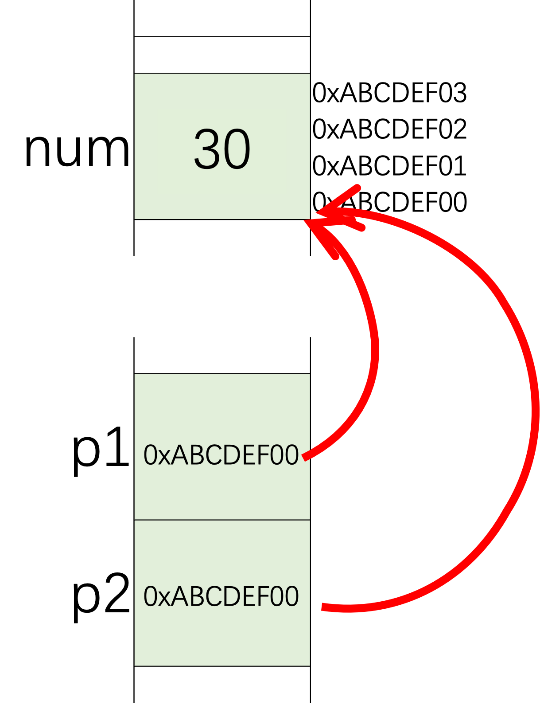
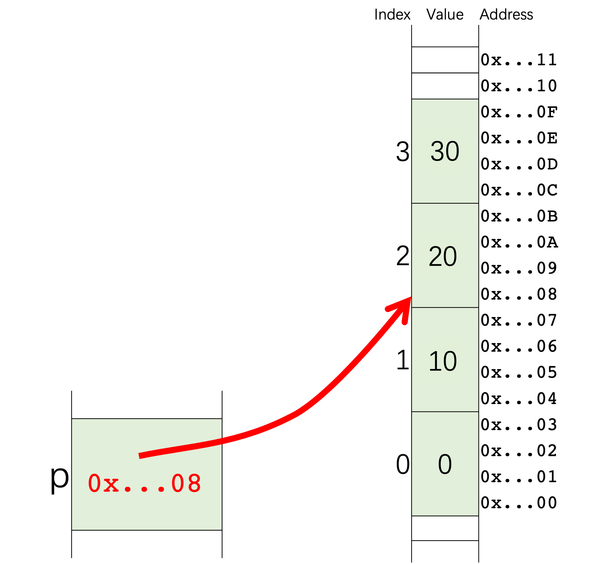
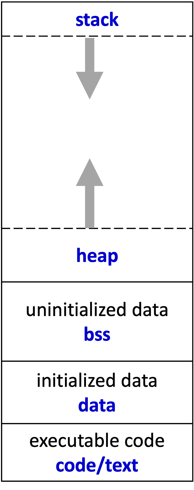

# Chapter 5: Pointers and Dynamic Memory Management

A pointer in C/C++ can be used to access a specific memory location and has very good efficiency. It is one of the unique advantages of C/C++, and also is a challenging knowledge point. You must be very careful to use it. Otherwise, some bugs will tend to be introduced.

## Pointers

Firstly, we should understand that a pointer is a variable for an address. Like other kinds of variables, a pointer has its value, and the value is an address in the memory.

There is an operator `&` which can return the address of a variable or an object. If we have a variable `int num = 10;`, we can get the address of `num` by `&num`. So we can declare a pointer and assign an address to it.

```cpp
int num = 10;
int * p1 = NULL, * p2 = NULL; // declaration two pointers, initialized to 0
p1 = &num; // take the address of num, assign to p1
p2 = &num; // take the address of num, assign to p2
*p1 = 20; // assign 20 to num
*p2 = 30; // assign 30 to num
```



In the previous source code, two pointers, `p1` and `p2`, are declared. Both of them are assigned the address of `num`. It means the two pointers point to the same memory, and the two pointers regard there is an `int` at that position of the memory.

Another operator here is `*` which is for pointer dereference. It can dereference the pointer to access the object. The following two lines are equivalent since `p1` is a pointer to `num`.

```cpp
*p1 = 20;
num = 20;
```

Pointers can not only point to some fundamental types such as `int`, `float`, but also point to objects of structures or objects and even functions. In the following code, a structure `stu` is declared and initialized. Then a pointer `pStu` is initialized to the address of `stu`. The structure and the pointer are illustrated in the following figure.

Since `stu` is a structure, we can use the dot operator `.` like `stu.name` to access its members. We can also use the pointer of `stu` to do that, but the operator will be `->`, not be `.`. `stu.name` is equivalent to `pStu->name`.

```cpp
struct Student
{
    char name[4];
    int born;
    bool male; 
};
//declare and initialize a structure
Student stu = {"Yu", 2000, true};
//assign the address of stu to pStu
Student * pStu = &stu;
//change members of the structure through pointer pStu
strncpy(pStu->name, "Li", 4);
pStu->born = 2001;
(*pStu).born = 2002;
pStu->male = false;
```


The address values contained in pointers can be printed out as shown in the following code.
```cpp
printf("Address of stu: %p\n", pStu); //C style
cout << "Address of stu: " << pStu << endl; //C++ style
cout << "Address of stu: " << &stu << endl;
cout << "Address of member name: " << &(pStu->name) << endl;
cout << "Address of member born: " << &(pStu->born) << endl;
cout << "Address of member male: " << &(pStu->male) << endl;
```

The address is an unsigned integer. It is a 32-bit unsigned integer on most 32-bit OS, and a 64-bit unsigned integer for most current 64-bit systems. You can run the following code to check how many bits your system uses for addresses.

```cpp
cout << "sizeof(int *) = " << sizeof(int *) << endl; // 4 or 8
cout << "sizeof(Student *) = " << sizeof(Student *) << endl; // 4 or 8
cout << "sizeof(pStu) = " << sizeof(pStu) << endl; // 4 or 8
```

### Pointers of pointers

Since a pointer is a variable, the variable will also be stored in memory and has its address. Then another pointer can point to this pointer. The figure shows the variable `num` in the example source code. The pointer `p` points to `num`, and the pointer `pp` points to `p`. `*(*pp) = 20` will change the value of `num` to `20`, and it is equivalent to `*p = 20` and `num = 20`.


```cpp
//pointer-pointer.cpp
#include <iostream>
using namespace std;

int main()
{
    int num = 10;
    int * p = &num;
    int ** pp = &p;
    *(*pp) = 20;

    cout << "num = " << num << endl;

    return 0;
}
```

### Constant pointers

If the `const` type qualifier is put before a fundamental type like `const int num = 1;`, the value of `num` cannot be changed after its initialization.

If `const` is put before the type name of a pointer as in the following example, you cannot change the value that the pointer points to.

```cpp
int num = 1;
//You cannot change the value that p1 points to through p1
const int * p1 = &num;
*p1 = 3; //error
num = 3; //okay
```

But you can change the pointer itself.

```cpp
p1 = &another; //okay
```

`const` can also be put between `*` and the name. If so, the pointer will point to that memory permanently, and cannot point to other places. But the value in that memory can be changed.

```cpp
//You cannot change value of p2 (address)
int * const p2 = &num;
*p2 = 3; //okay
p2 = &another; //error
```

If two `const` are used as follows, then neither the address nor the value can be changed.
```cpp
//You can change neither
const int* const p3 = &num;
*p3 = 3; //error
p3 = &another; // error
```

### Pointers and arrays

The elements in an array are also stored in memory and have their addresses. The following code shows how to get the addresses of the first 4 elements in an array and assign them to 4 pointer variables. After printing out the addresses, you can find those addresses have an interval of `sizeof(Student)`. Member `born` of the second element can be accessed by `students[1].born` or `p1->born`.

```cpp
//pointer-array.cpp
Student students[128];
Student * p0 = &students[0];
Student * p1 = &students[1];
Student * p2 = &students[2];
Student * p3 = &students[3];

printf("p0 = %p\n", p0);
printf("p1 = %p\n", p1);
printf("p2 = %p\n", p2);
printf("p3 = %p\n", p3);

//the same behavior
students[1].born = 2000;
p1->born = 2000;
```

The output of the previous source code on my computer is
```bash
p0 = 0x16f3d6e58
p1 = 0x16f3d6e64
p2 = 0x16f3d6e70
p3 = 0x16f3d6e7c
```

You can consider an array name as a pointer. The difference between an array name and a pointer is that an array can only point to the same memory. An array name can be regarded as a constant pointer to a memory location permanently.

We print the value of `&students`, `students` and `&students[0]`, and it can be found that the three addresses are the same and are all the address of the first element in array `students`.

```cpp
//pointer-array.cpp
printf("&students = %p\n", &students);
printf("students = %p\n", students);
printf("&students[0] = %p\n", &students[0]);
```

The output of the previous source code on my computer is

```bash
&students = 0x16f3d6e58
students = 0x16f3d6e58
&students[0] = 0x16f3d6e58
```
If we assign an array (the address) to a pointer `p`, then `p` can be used in an array style (`p[0]`) to access the elements. `p` is a pointer to a position of the memory and regards that position as the starting address of an object. But `p` does not know how many elements are there. We must be very careful with the out-of-bound error.

```cpp
//pointer-array.cpp
Student * p = students;
p[0].born = 2000;
p[1].born = 2001;
p[2].born = 2002;
```

Since the value of a pointer is an address, an integer number, you can perform arithmetic operations on a pointer. But be careful that the address will not increase 1 after you perform `p + 1`. `p + num` or `num + p` points to the **num-th** element of the array `p`. `p - num` points to the **(-num)-th** element. The address value changes according to the data type. If the data type is `float *`, then the address will increase 4 bytes after `p + 1` or `p++`.

```cpp
//arithmetic.cpp
int numbers[4] = {0, 1, 2, 3};
int * p = numbers + 1; // point to the element with value 1
p++; // point to the element with value 2

*p = 20; //change number[2] from 2 to 20
*(p-1) = 10; //change number[1] from 1 to 10
p[1] = 30; //change number[3] from 3 to 30
```




We do not know how many elements followed the address that a pointer points to, and we also do not know if a pointer is from an integer or an integer array. The following code can be compiled successfully, but the memory accessing will be out-of-bound.

```cpp
//bound.cpp
int num = 0;
int * p = &num;
p[-1] = 2; //out of bound
p[0] = 3; //okay
*(p+1) = 4; //out of bound
````


## Allocate memory: C style

When a program is executed by the operating system (OS), the OS will allocate memory for the program. The memory for a program can be divided into 5 segments as shown in the following figure. 



* Code: It contains executable code. It is read-only and fixed size.
* Data: It contains initialized static variables including global static and local static ones.
* BSS: BSS section contains uninitialized static data.
* Heap: It contains dynamically allocated memory. The memory allocated by `malloc()` or `new` is in this segment.
* Stack: Local variables and call stack are stored in it.

## Allocate memory: C++ style


## Lab

* allocate memory for an array string, modify elements by integer values one by one, then print out the result as a string. Please try to modify the element out of range and see what will happen.
